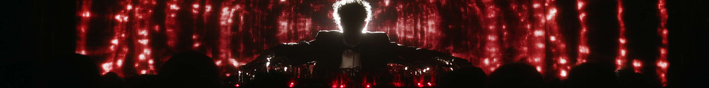

# Seedance Prompter



A [Claude Code](https://claude.com/claude-code) skill that turns a rough video idea
into a copy-ready [Seedance 2.0](https://seedance.ai) prompt — through a short
director's interview.

It plays film director and prompt engineer at once: it hears your idea, gives it an
honest read (is there one pause-worthy frame, or is this secretly three acts?),
interviews you with clickable options for format, references, genre grammar, camera
architecture, and visual style, then writes a camera-first, 8-block, English-only
prompt with the technical tail Seedance actually needs to hold a face and a location
together for 15 seconds. It also diagnoses renders that came out wrong and rewrites
them.

## About

Built by [Sinaida Krivchenko](https://sinaida.eu) — a new media artist working in
interactive projections, TouchDesigner, GLSL shaders, generative AI, and web
applications.

- Website: [sinaida.eu](https://sinaida.eu)
- Instagram: [@sin.ai.da](https://www.instagram.com/sin.ai.da/)

## What is Seedance?

Seedance 2.0 is a text/image-to-video generation model with a hard 15-second-per-render
limit. It doesn't parse a prompt as flowing prose — it weighs `@Reference` tags and a
fixed "technical tail" far above mood adjectives like "cinematic" or "epic". This skill
encodes that priority order so every prompt it writes actually gets read correctly by
the model, instead of being ignored past the first sentence.

## Install

Copy this repo into your Claude Code skills directory:

```bash
git clone https://github.com/sinaida-space/seedance_prompter.git ~/.claude/skills/seedance-prompter
```

(If you keep other personal skills elsewhere, just copy `SKILL.md` and `references/`
into wherever your skills live.)

## Use

In Claude Code, either:

- Say `/seedance-prompter`, or
- Just describe your video idea naturally — "help me write a Seedance prompt for a
  fashion reel", "I have a rough idea for a video", etc.

The skill will:

1. **Hear the idea** and rate it honestly — no flattery, no vague adjectives. If it's
   thin or overloaded for a 15-second render, it pushes back and helps sharpen it
   (reduce to the one frame that matters, reverse the reveal, tighten the constraint).
2. **Interview you** with clickable option menus (never a wall of text to answer) for
   format, references, genre grammar, camera architecture, palette/texture, and
   character.
3. **Write the prompt** — English only, camera-first in every beat, ending with the
   mandatory technical tail, following Seedance's 8-block structure.
4. **Run a 14-point pre-flight check** before handing it back.
5. **Diagnose bad renders** — describe what went wrong and it matches the symptom to
   a root cause and hands back a corrected prompt.

It talks to you in whatever language you open the conversation in — the *prompt
itself* is always English, since Seedance is an English-trained model and mixed-
language prompts degrade quality.

For longer videos, it won't try to cram a story into one render — it builds a shot
list first, gets sign-off, then writes one full prompt per shot, reusing the same
character reference across all of them.

Check one of the videos done with this prompter: https://www.instagram.com/p/DadaBApivfH/

## Structure

```
SKILL.md                                      entry point — director persona, interview flow, prompt template, hard rules
references/camera-and-style.md                camera movement table, film stocks, color grades, textures, named styles
references/genre-playbooks.md                 8 genre grammars with full example prompts (product, fashion, sci-fi, music video, horror, documentary, viral hook, UGC)
references/troubleshooting.md                 error taxonomy, 14-point pre-flight checklist, reference-photo requirements, glossary
references/cinematography-and-editing.md      shot sizes, camera angles, blocking, composition; editing theory — Walter Murch's Rule of Six and the Kuleshov effect for shot-list sequencing
```

## License

MIT — use it, fork it, adapt it for your own prompt-engineering workflows.
